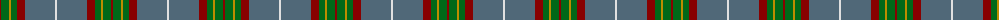
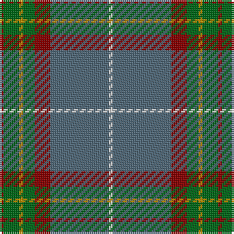

The parent of this is [Bressuire (District)](/tartans/dr/2/g8/dy2/g6/dr8/n30/ln/2/)

This was sourced from tartans-authority.  It is a [7 stripes tartan](/stripes/stripes7/).

Original link http://www.tartansauthority.com/tartan-ferret/display/10260/

## Thread count
DR/2 G8 DY2 G6 DR8 N30 LN/2

## Palette
Each colour and its ΔE from the base-6 reference it is a variant of.

| Colour | Shade | Base | ΔE (OKLab) |
|---|---|---|---|
| DR |  `#880000` | R  | 0.14 |
| DY |  `#BC8C00` | Y  | 0.16 |
| G |  `#006818` | G  | 0.02 |
| LN |  `#E0E0E0` | W  | 0.06 |
| N |  `#506878` | B  | 0.14 |

# Sample pattern

ID: /variants/dr/2/g8/dy2/g6/dr8/n30/ln/2-dr880000-dybc8c00-g006818-lne0e0e0-n506878/
