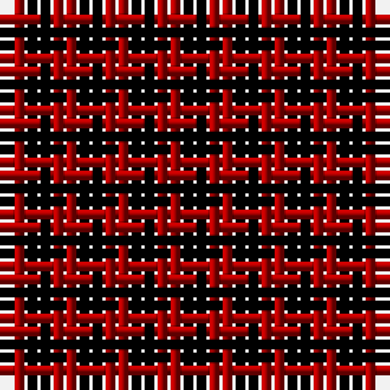

The parent of this is [Rob Roy](/tartans/dr/2/k/2/)

This was sourced from weddslist.  It is a [2 stripes tartan](/stripes/stripes2/).

Original link http://www.weddslist.com/cgi-bin/tartans/pg.pl?source=tinsel

## Thread count
DR/2 K/2

## Palette
DR K

# Sample pattern

ID: /variants/dr/2/k/2-draa0000-k000000/
