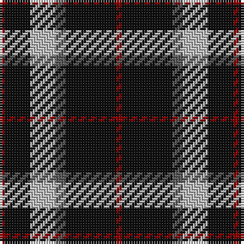

The parent of this is [Callaway (Corporate)](/tartans/dr/2/k10/n10/na4/k20/dr/2/)

This was sourced from register-of-tartans.  It is a [6 stripes tartan](/stripes/stripes6/).

Original link https://www.tartanregister.gov.uk/tartanDetails.aspx?ref=484

## Thread count
DR/2 K10 N10 Na4 K20 DR/2

## Palette
Each colour and its ΔE from the base-6 reference it is a variant of.

| Colour | Shade | Base | ΔE (OKLab) |
|---|---|---|---|
| DR |  `#880000` | R  | 0.14 |
| K |  `#101010` | K  | 0.17 |
| N |  `#C0C0C0` | W  | 0.16 |
| Na |  `#5C5C5C` | B  | 0.14 |

# Sample pattern

ID: /variants/dr/2/k10/n10/na4/k20/dr/2-dr880000-k101010-nc0c0c0-na5c5c5c/
