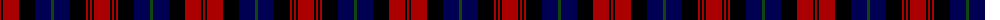

The parent of this is [MacLachlan](/tartans/dr/2/k2/dr16/k16/db16/dg3/db16/k16/dr2/k2/dr2/k2/dr/16/)

This was sourced from weddslist.  It is a [13 stripes tartan](/stripes/stripes13/).

Original link http://www.weddslist.com/cgi-bin/tartans/pg.pl?source=x

## Thread count
DR/2 K2 DR16 K16 DB16 DG3 DB16 K16 DR2 K2 DR2 K2 DR/16

## Palette
Each colour and its ΔE from the base-6 reference it is a variant of.

| Colour | Shade | Base | ΔE (OKLab) |
|---|---|---|---|
| DB |  `#000052` | B  | 0.20 |
| DG |  `#11450D` | G  | 0.10 |
| DR |  `#AA0000` | R  | 0.06 |
| K |  `#000000` | K  | 0.00 |

ID: /variants/dr/2/k2/dr16/k16/db16/dg3/db16/k16/dr2/k2/dr2/k2/dr/16-db000052-dg11450d-draa0000-k000000/
