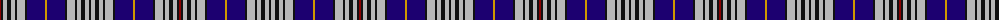

The parent of this is [Hanna of Stirlingshire](/tartans/dr/2/k2/n4/k4/n4/k2/n8/k2/db18/dy2/db18/k2/n8/k2/n4/k4/n4/k/2/)

This was sourced from register-of-tartans.  It is a [18 stripes tartan](/stripes/stripes18/).

Original link https://www.tartanregister.gov.uk/tartanDetails.aspx?ref=1586

## Thread count
DR/2 K2 N4 K4 N4 K2 N8 K2 DB18 DY2 DB18 K2 N8 K2 N4 K4 N4 K/2

## Palette
Each colour and its ΔE from the base-6 reference it is a variant of.

| Colour | Shade | Base | ΔE (OKLab) |
|---|---|---|---|
| DB |  `#1C0070` | B  | 0.14 |
| DR |  `#880000` | R  | 0.14 |
| DY |  `#D09800` | Y  | 0.11 |
| K |  `#101010` | K  | 0.17 |
| N |  `#B8B8B8` | Y  | 0.17 |

ID: /variants/dr/2/k2/n4/k4/n4/k2/n8/k2/db18/dy2/db18/k2/n8/k2/n4/k4/n4/k/2-db1c0070-dr880000-dyd09800-k101010-nb8b8b8/
