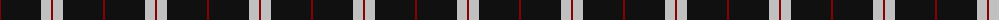
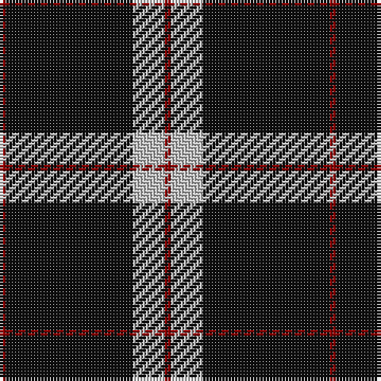

The parent of this is [Dobelman (Personal)](/tartans/dr/2/k40/n10/dr/2/)

This was sourced from tartans-authority.  It is a [4 stripes tartan](/stripes/stripes4/).

Original link http://www.tartansauthority.com/tartan-ferret/display/3241/

## Thread count
DR/2 K40 N10 DR/2

## Palette
Each colour and its ΔE from the base-6 reference it is a variant of.

| Colour | Shade | Base | ΔE (OKLab) |
|---|---|---|---|
| DR |  `#880000` | R  | 0.14 |
| K |  `#101010` | K  | 0.17 |
| N |  `#C0C0C0` | W  | 0.16 |

# Sample pattern

ID: /variants/dr/2/k40/n10/dr/2-dr880000-k101010-nc0c0c0/
