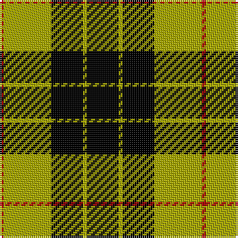

The parent of this is [MacLeod of Lewis](/tartans/dr/2/lg24/k16/lg2/k/16/)

This was sourced from weddslist.  It is a [5 stripes tartan](/stripes/stripes5/).

Original link http://www.weddslist.com/cgi-bin/tartans/pg.pl?source=x

## Thread count
DR/2 LG24 K16 LG2 K/16

## Palette
Each colour and its ΔE from the base-6 reference it is a variant of.

| Colour | Shade | Base | ΔE (OKLab) |
|---|---|---|---|
| DR |  `#AA0000` | R  | 0.06 |
| K |  `#000000` | K  | 0.00 |
| LG |  `#AAAA00` | Y  | 0.11 |

# Sample pattern

ID: /variants/dr/2/lg24/k16/lg2/k/16-draa0000-k000000-lgaaaa00/
