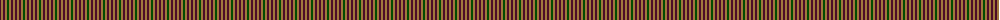
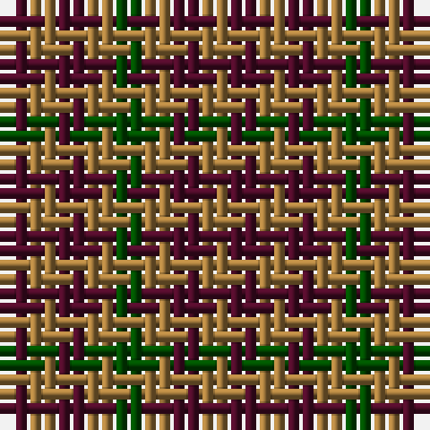

The parent of this is [Ballindalloch Check](/tartans/dr/2/lt2/dr2/lt2/g/2/)

This was sourced from register-of-tartans.  It is a [5 stripes tartan](/stripes/stripes5/).

Original link https://www.tartanregister.gov.uk/tartanDetails.aspx?ref=5001

## Thread count
DR/2 LT2 DR2 LT2 G/2

## Palette
Each colour and its ΔE from the base-6 reference it is a variant of.

| Colour | Shade | Base | ΔE (OKLab) |
|---|---|---|---|
| DR |  `#4C0C28` | B  | 0.19 |
| G |  `#004C00` | G  | 0.08 |
| LT |  `#A0783C` | R  | 0.18 |

# Sample pattern

ID: /variants/dr/2/lt2/dr2/lt2/g/2-dr4c0c28-g004c00-lta0783c/
