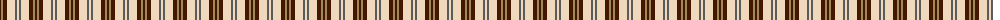
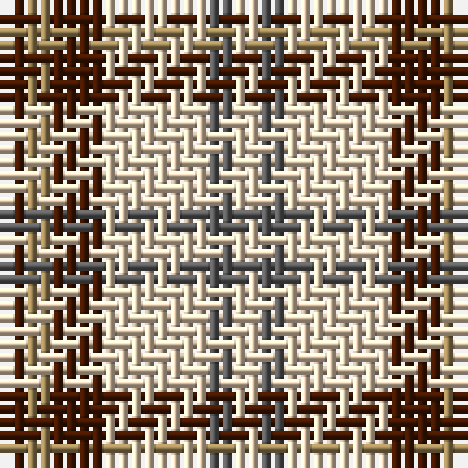

The parent of this is [Ardalansish Tweed (Fashion)](/tartans/dr/2/lt2/dr4/w8/n2/w/2/)

This was sourced from tartans-authority.  It is a [6 stripes tartan](/stripes/stripes6/).

Original link http://www.tartansauthority.com/tartan-ferret/display/8008/

## Thread count
DR/2 LT2 DR4 W8 N2 W/2

## Palette
Each colour and its ΔE from the base-6 reference it is a variant of.

| Colour | Shade | Base | ΔE (OKLab) |
|---|---|---|---|
| DR |  `#441800` | B  | 0.22 |
| LT |  `#A08858` | Y  | 0.21 |
| N |  `#5C5C5C` | B  | 0.14 |
| W |  `#F0D8BC` | W  | 0.08 |

# Sample pattern

ID: /variants/dr/2/lt2/dr4/w8/n2/w/2-dr441800-lta08858-n5c5c5c-wf0d8bc/
