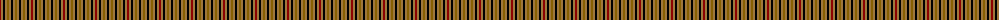

The parent of this is [Seaforth Estate Check Estate Check Weavers Tartan Tartan Number: 5344. Earliest known date: pre 1990 No details. See products available Copyright © Blair Urquhart, Comrie, 2015](/tartans/dr/2/lt2/k2/lt2/t2/lt2/k2/lt2/t/2/)

This was sourced from house-of-tartan.  It is a [9 stripes tartan](/stripes/stripes9/).

Original link http://www.house-of-tartan.scotland.net/house/TartanViewjs.asp?colr=Def&tnam=5344

## Thread count
DR/2 LT2 K2 LT2 T2 LT2 K2 LT2 T/2

## Palette
Each colour and its ΔE from the base-6 reference it is a variant of.

| Colour | Shade | Base | ΔE (OKLab) |
|---|---|---|---|
| DR |  `#8C0000` | R  | 0.13 |
| K |  `#000000` | K  | 0.00 |
| LT |  `#A0783C` | R  | 0.18 |
| T |  `#886000` | G  | 0.16 |

ID: /variants/dr/2/lt2/k2/lt2/t2/lt2/k2/lt2/t/2-dr8c0000-k000000-lta0783c-t886000/
