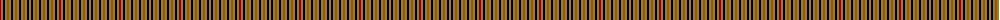

The parent of this is [Seaforth Estate Check](/tartans/dr/2/lt2/k2/lt2/t2/lt2/k2/lt2/t2/lt2/k2/lt2/t2/lt2/k2/lt/2/)

This was sourced from register-of-tartans.  It is a [16 stripes tartan](/stripes/stripes16/).

Original link https://www.tartanregister.gov.uk/tartanDetails.aspx?ref=3755

## Thread count
DR/2 LT2 K2 LT2 T2 LT2 K2 LT2 T2 LT2 K2 LT2 T2 LT2 K2 LT/2

## Palette
Each colour and its ΔE from the base-6 reference it is a variant of.

| Colour | Shade | Base | ΔE (OKLab) |
|---|---|---|---|
| DR |  `#8C0000` | R  | 0.13 |
| K |  `#000000` | K  | 0.00 |
| LT |  `#A0783C` | R  | 0.18 |
| T |  `#886000` | G  | 0.16 |

ID: /variants/dr/2/lt2/k2/lt2/t2/lt2/k2/lt2/t2/lt2/k2/lt2/t2/lt2/k2/lt/2-dr8c0000-k000000-lta0783c-t886000/
