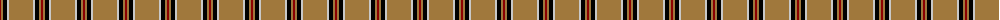
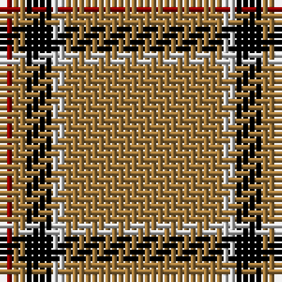

The parent of this is [Lochcarron Camel](/tartans/dr/2/lt2/k4/n2/lt/24/)

This was sourced from register-of-tartans.  It is a [5 stripes tartan](/stripes/stripes5/).

Original link https://www.tartanregister.gov.uk/tartanDetails.aspx?ref=2168

## Thread count
DR/2 LT2 K4 N2 LT/24

## Palette
Each colour and its ΔE from the base-6 reference it is a variant of.

| Colour | Shade | Base | ΔE (OKLab) |
|---|---|---|---|
| DR |  `#8C0000` | R  | 0.13 |
| K |  `#000000` | K  | 0.00 |
| LT |  `#A0783C` | R  | 0.18 |
| N |  `#C8C8C8` | W  | 0.13 |

# Sample pattern

ID: /variants/dr/2/lt2/k4/n2/lt/24-dr8c0000-k000000-lta0783c-nc8c8c8/
