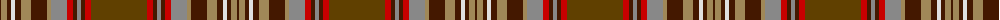

The parent of this is [Caithness District Tartan Tartan Number: 2466. Earliest known date: (Feb, 2001) Designed by Trudi Mann of Wick and incorporating colours of Caithness, including the unique blue grey Caithness flagstone. See products available Copyright © Blair Urquhart, Comrie, 2015](/tartans/dr/2/lt6/dr4/ln4/dr6/lt10/dr16/lt4/n16/r6/dr4/n4/dr4/r6/t/56/)

This was sourced from house-of-tartan.  It is a [15 stripes tartan](/stripes/stripes15/).

Original link http://www.house-of-tartan.scotland.net/house/TartanViewjs.asp?colr=Def&tnam=2466

## Thread count
DR/2 LT6 DR4 LN4 DR6 LT10 DR16 LT4 N16 R6 DR4 N4 DR4 R6 T/56

## Palette
Each colour and its ΔE from the base-6 reference it is a variant of.

| Colour | Shade | Base | ΔE (OKLab) |
|---|---|---|---|
| DR |  `#441800` | B  | 0.22 |
| LN |  `#E0E0E0` | W  | 0.06 |
| LT |  `#A08858` | Y  | 0.21 |
| N |  `#888888` | R  | 0.24 |
| R |  `#C80000` | R  | 0.00 |
| T |  `#604000` | G  | 0.14 |

ID: /variants/dr/2/lt6/dr4/ln4/dr6/lt10/dr16/lt4/n16/r6/dr4/n4/dr4/r6/t/56-dr441800-lne0e0e0-lta08858-n888888-rc80000-t604000/
