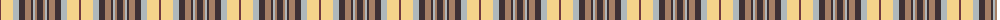

The parent of this is [Toorak Chapler](/tartans/dr/2/ly12/n6/t6/lt6/t2/n2/lt2/t/6/)

This was sourced from register-of-tartans.  It is a [9 stripes tartan](/stripes/stripes9/).

Original link https://www.tartanregister.gov.uk/tartanDetails.aspx?ref=10499

## Thread count
DR/2 LY12 N6 T6 LT6 T2 N2 LT2 T/6

## Palette
Each colour and its ΔE from the base-6 reference it is a variant of.

| Colour | Shade | Base | ΔE (OKLab) |
|---|---|---|---|
| DR |  `#72393F` | B  | 0.16 |
| LT |  `#A58065` | R  | 0.20 |
| LY |  `#F5D38B` | Y  | 0.09 |
| N |  `#AFB8BB` | Y  | 0.18 |
| T |  `#3D3134` | B  | 0.14 |

ID: /variants/dr/2/ly12/n6/t6/lt6/t2/n2/lt2/t/6-dr72393f-lta58065-lyf5d38b-nafb8bb-t3d3134/
