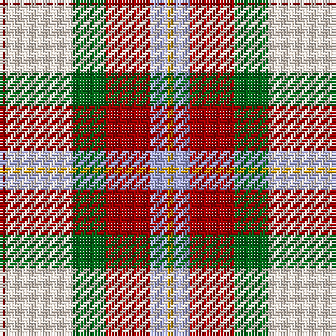

The parent of this is [MacLean Dress (Lumsden)](/tartans/dr/2/ly24/g12/dr16/lp6/dy/2/)

This was sourced from tartans-authority.  It is a [6 stripes tartan](/stripes/stripes6/).

Original link http://www.tartansauthority.com/tartan-ferret/display/1686/

## Thread count
DR/2 LY24 G12 DR16 LP6 DY/2

## Palette
Each colour and its ΔE from the base-6 reference it is a variant of.

| Colour | Shade | Base | ΔE (OKLab) |
|---|---|---|---|
| DR |  `#A40000` | R  | 0.08 |
| DY |  `#D09800` | Y  | 0.11 |
| G |  `#006818` | G  | 0.02 |
| LP |  `#A8ACE8` | W  | 0.22 |
| LY |  `#F8ECE0` | W  | 0.02 |

# Sample pattern

ID: /variants/dr/2/ly24/g12/dr16/lp6/dy/2-dra40000-dyd09800-g006818-lpa8ace8-lyf8ece0/
