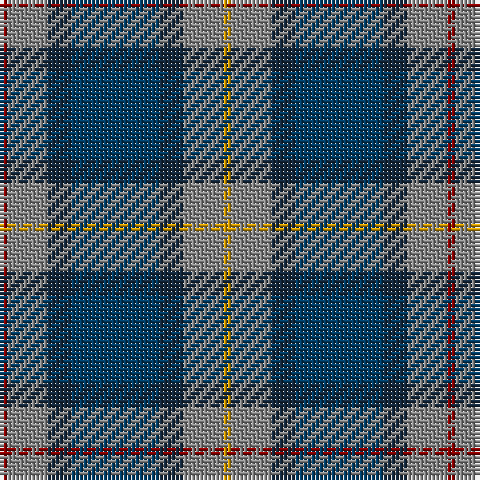

The parent of this is [Newmill (Corporate)](/tartans/dr/2/n10/dn6/db22/dn6/n10/dy/2/)

This was sourced from tartans-authority.  It is a [7 stripes tartan](/stripes/stripes7/).

Original link http://www.tartansauthority.com/tartan-ferret/display/2053/

## Thread count
DR/2 N10 DN6 DB22 DN6 N10 DY/2

## Palette
Each colour and its ΔE from the base-6 reference it is a variant of.

| Colour | Shade | Base | ΔE (OKLab) |
|---|---|---|---|
| DB |  `#003C64` | B  | 0.07 |
| DN |  `#14283C` | B  | 0.14 |
| DR |  `#880000` | R  | 0.14 |
| DY |  `#D09800` | Y  | 0.11 |
| N |  `#888888` | R  | 0.24 |

# Sample pattern

ID: /variants/dr/2/n10/dn6/db22/dn6/n10/dy/2-db003c64-dn14283c-dr880000-dyd09800-n888888/
