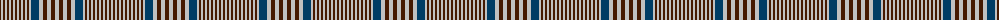

The parent of this is [Prince of Wales (Estate Check)](/tartans/dr/2/n2/dr2/n2/dr2/n2/dr2/n2/dr2/n2/dr2/n2/dr2/n2/dr2/n2/db8/n4/dr4/n4/dr4/n/4/)

This was sourced from tartans-authority.  It is a [22 stripes tartan](/stripes/stripes22/).

Original link http://www.tartansauthority.com/tartan-ferret/display/3309/

## Thread count
DR/2 N2 DR2 N2 DR2 N2 DR2 N2 DR2 N2 DR2 N2 DR2 N2 DR2 N2 DB8 N4 DR4 N4 DR4 N/4

## Palette
Each colour and its ΔE from the base-6 reference it is a variant of.

| Colour | Shade | Base | ΔE (OKLab) |
|---|---|---|---|
| DB |  `#003C64` | B  | 0.07 |
| DR |  `#441800` | B  | 0.22 |
| N |  `#C0C0C0` | W  | 0.16 |

ID: /variants/dr/2/n2/dr2/n2/dr2/n2/dr2/n2/dr2/n2/dr2/n2/dr2/n2/dr2/n2/db8/n4/dr4/n4/dr4/n/4-db003c64-dr441800-nc0c0c0/
