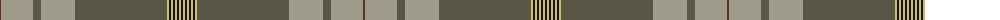

The parent of this is [Saunders (Personal)](/tartans/dr/2/n32/na8/n34/na92/lg2/k2/lg2/k2/lg2/k2/lg2/k/2/)

This was sourced from register-of-tartans.  It is a [13 stripes tartan](/stripes/stripes13/).

Original link https://www.tartanregister.gov.uk/tartanDetails.aspx?ref=10109

## Thread count
DR/2 N32 Na8 N34 Na92 LG2 K2 LG2 K2 LG2 K2 LG2 K/2

## Palette
Each colour and its ΔE from the base-6 reference it is a variant of.

| Colour | Shade | Base | ΔE (OKLab) |
|---|---|---|---|
| DR |  `#672C26` | B  | 0.18 |
| K |  `#101010` | K  | 0.17 |
| LG |  `#CFC25A` | Y  | 0.05 |
| N |  `#9F9C8B` | Y  | 0.19 |
| Na |  `#595645` | G  | 0.13 |

ID: /variants/dr/2/n32/na8/n34/na92/lg2/k2/lg2/k2/lg2/k2/lg2/k/2-dr672c26-k101010-lgcfc25a-n9f9c8b-na595645/
