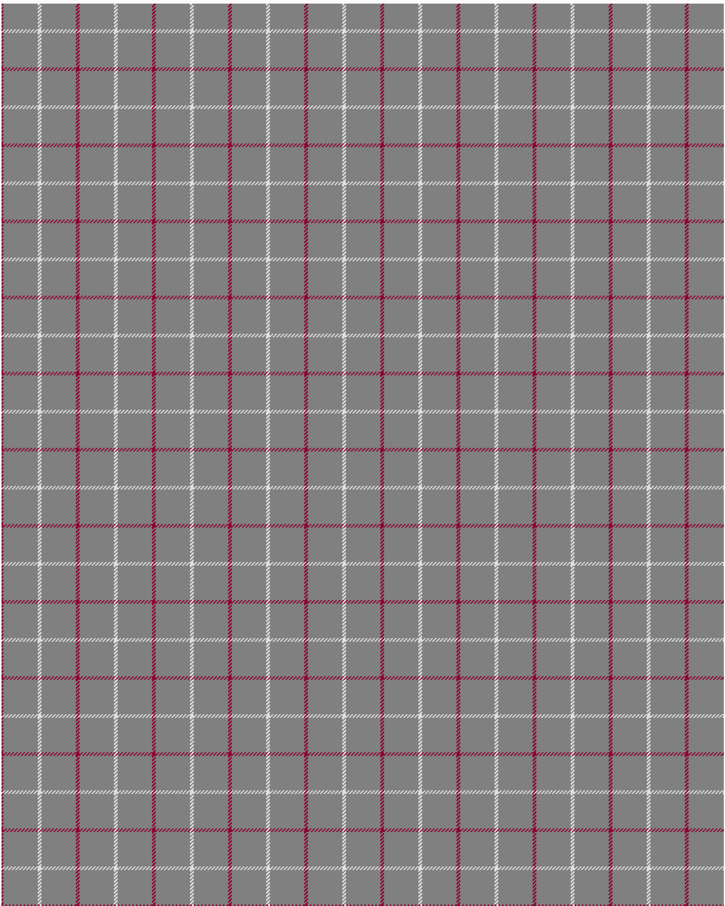

Dunbar of Pitgaveny

This was sourced from <no value>.  It is a 3 stripes tartan.

Original link http://www.weddslist.com/cgi-bin/tartans/pg.pl?source=sts

## Thread count
DR/2 N38 LN/2

## Palette
DR#900030 LN#E0E0E0 N#808080

# Sample pattern

ID: /variants/dr/2/n38/ln/2-dr900030-lne0e0e0-n808080