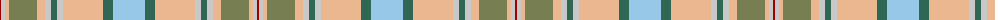

The parent of this is [Bouguet, Adrian Dress (Personal)](/tartans/dr/2/n4/lr4/ga28/lr8/n6/g6/n6/lr40/g10/lb/32/)

This was sourced from register-of-tartans.  It is a [11 stripes tartan](/stripes/stripes11/).

Original link https://www.tartanregister.gov.uk/tartanDetails.aspx?ref=11265

## Thread count
DR/2 N4 LR4 Ga28 LR8 N6 G6 N6 LR40 G10 LB/32

## Palette
Each colour and its ΔE from the base-6 reference it is a variant of.

| Colour | Shade | Base | ΔE (OKLab) |
|---|---|---|---|
| DR |  `#A00000` | R  | 0.09 |
| G |  `#306754` | G  | 0.10 |
| Ga |  `#767E52` | G  | 0.17 |
| LB |  `#98C8E8` | W  | 0.17 |
| LR |  `#EBB790` | Y  | 0.11 |
| N |  `#C8C8C8` | W  | 0.13 |

ID: /variants/dr/2/n4/lr4/ga28/lr8/n6/g6/n6/lr40/g10/lb/32-dra00000-g306754-ga767e52-lb98c8e8-lrebb790-nc8c8c8/
