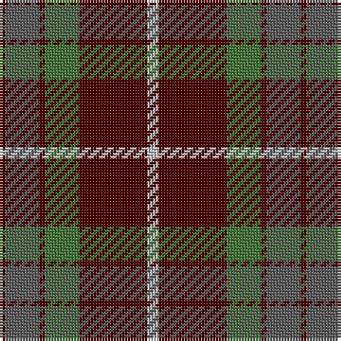

The parent of this is [Fraser Green](/tartans/dr/2/na12/dr2/g12/dr24/n/4/)

This was sourced from register-of-tartans.  It is a [6 stripes tartan](/stripes/stripes6/).

Original link https://www.tartanregister.gov.uk/tartanDetails.aspx?ref=1257

## Thread count
DR/2 Na12 DR2 G12 DR24 N/4

## Palette
Each colour and its ΔE from the base-6 reference it is a variant of.

| Colour | Shade | Base | ΔE (OKLab) |
|---|---|---|---|
| DR |  `#4C0000` | B  | 0.24 |
| G |  `#447438` | G  | 0.09 |
| N |  `#C0C0C0` | W  | 0.16 |
| Na |  `#5C5C5C` | B  | 0.14 |

# Sample pattern

ID: /variants/dr/2/na12/dr2/g12/dr24/n/4-dr4c0000-g447438-nc0c0c0-na5c5c5c/
