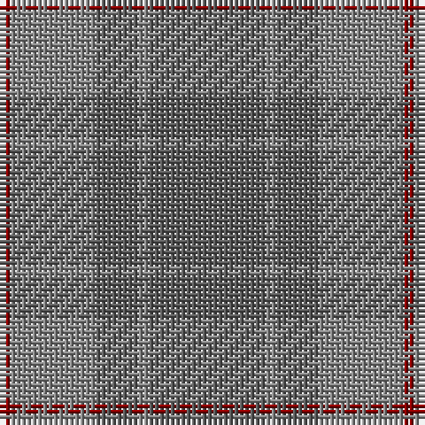

The parent of this is [Cairns, David (Personal)](/tartans/dr/2/na16/n8/na2/n/22/)

This was sourced from tartans-authority.  It is a [5 stripes tartan](/stripes/stripes5/).

Original link http://www.tartansauthority.com/tartan-ferret/display/10143/

## Thread count
DR/2 Na16 N8 Na2 N/22

## Palette
Each colour and its ΔE from the base-6 reference it is a variant of.

| Colour | Shade | Base | ΔE (OKLab) |
|---|---|---|---|
| DR |  `#880000` | R  | 0.14 |
| N |  `#5C5C5C` | B  | 0.14 |
| Na |  `#888888` | R  | 0.24 |

# Sample pattern

ID: /variants/dr/2/na16/n8/na2/n/22-dr880000-n5c5c5c-na888888/
