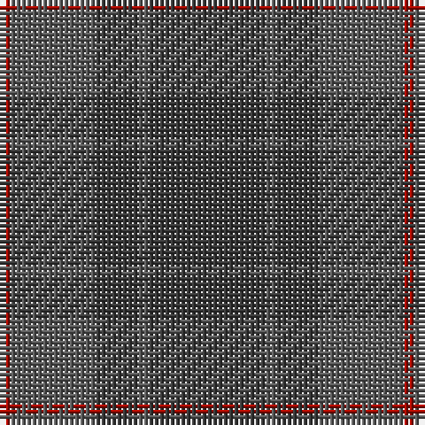

The parent of this is [Cairns, David (Personal)](/tartans/dr/2/na16/n8/na2/n/22/)

This was sourced from register-of-tartans.  It is a [5 stripes tartan](/stripes/stripes5/).

Original link https://www.tartanregister.gov.uk/tartanDetails.aspx?ref=10143

## Thread count
DR/2 Na16 N8 Na2 N/22

## Palette
Each colour and its ΔE from the base-6 reference it is a variant of.

| Colour | Shade | Base | ΔE (OKLab) |
|---|---|---|---|
| DR |  `#A40B00` | R  | 0.08 |
| N |  `#393939` | B  | 0.13 |
| Na |  `#5B5B5B` | B  | 0.14 |

# Sample pattern

ID: /variants/dr/2/na16/n8/na2/n/22-dra40b00-n393939-na5b5b5b/
