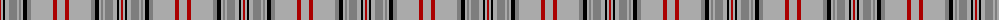

The parent of this is [Balmoral](/tartans/dr/2/na2/k2/na4/n8/na2/n2/na2/k4/n4/na22/dr4/na/8/)

This was sourced from weddslist.  It is a [13 stripes tartan](/stripes/stripes13/).

Original link http://www.weddslist.com/cgi-bin/tartans/pg.pl?source=x

## Thread count
DR/2 Na2 K2 Na4 N8 Na2 N2 Na2 K4 N4 Na22 DR4 Na/8

## Palette
Each colour and its ΔE from the base-6 reference it is a variant of.

| Colour | Shade | Base | ΔE (OKLab) |
|---|---|---|---|
| DR |  `#AA0000` | R  | 0.06 |
| K |  `#000000` | K  | 0.00 |
| N |  `#7E7E7E` | G  | 0.22 |
| Na |  `#AAAAAA` | Y  | 0.19 |

ID: /variants/dr/2/na2/k2/na4/n8/na2/n2/na2/k4/n4/na22/dr4/na/8-draa0000-k000000-n7e7e7e-naaaaaaa/
