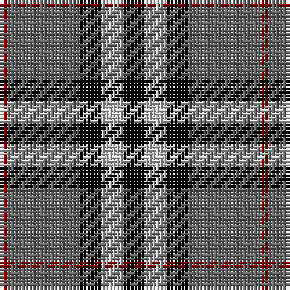

The parent of this is [Greystone (Fashion)](/tartans/dr/2/na20/k6/n6/k/6/)

This was sourced from tartans-authority.  It is a [5 stripes tartan](/stripes/stripes5/).

Original link http://www.tartansauthority.com/tartan-ferret/display/5123/

## Thread count
DR/2 Na20 K6 N6 K/6

## Palette
Each colour and its ΔE from the base-6 reference it is a variant of.

| Colour | Shade | Base | ΔE (OKLab) |
|---|---|---|---|
| DR |  `#8C0000` | R  | 0.13 |
| K |  `#000000` | K  | 0.00 |
| N |  `#C8C8C8` | W  | 0.13 |
| Na |  `#646464` | B  | 0.16 |

# Sample pattern

ID: /variants/dr/2/na20/k6/n6/k/6-dr8c0000-k000000-nc8c8c8-na646464/
