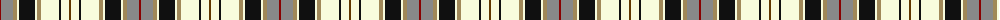

The parent of this is [Kintyre](/tartans/dr/2/nb12/lt4/ly2/k16/ly2/lt4/ly18/k2/ly8/t/2/)

This was sourced from register-of-tartans.  It is a [11 stripes tartan](/stripes/stripes11/).

Original link https://www.tartanregister.gov.uk/tartanDetails.aspx?ref=2001

## Thread count
DR/2 Nb12 LT4 LY2 K16 LY2 LT4 LY18 K2 LY8 T/2

## Palette
Each colour and its ΔE from the base-6 reference it is a variant of.

| Colour | Shade | Base | ΔE (OKLab) |
|---|---|---|---|
| DR |  `#880000` | R  | 0.14 |
| G |  `#006818` | G  | 0.02 |
| Ga |  `#5C6428` | G  | 0.09 |
| K |  `#101010` | K  | 0.17 |
| LG |  `#789484` | G  | 0.23 |
| LT |  `#A08858` | Y  | 0.21 |
| LY |  `#F8FCDC` | W  | 0.04 |
| N |  `#5C5C5C` | B  | 0.14 |
| Na |  `#B8B8B8` | Y  | 0.17 |
| Nb |  `#888888` | R  | 0.24 |
| T |  `#603800` | G  | 0.16 |

ID: /variants/dr/2/nb12/lt4/ly2/k16/ly2/lt4/ly18/k2/ly8/t/2-dr880000-g006818-ga5c6428-k101010-lg789484-lta08858-lyf8fcdc-n5c5c5c-nab8b8b8-nb888888-t603800/
