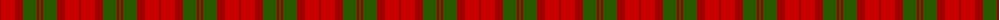
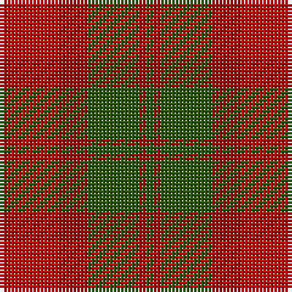

The parent of this is [Dewar (Name)](/tartans/dr/2/r14/dr8/g14/dr2/g/2/)

This was sourced from tartans-authority.  It is a [6 stripes tartan](/stripes/stripes6/).

Original link http://www.tartansauthority.com/tartan-ferret/display/3400/

## Thread count
DR/2 R14 DR8 G14 DR2 G/2

## Palette
Each colour and its ΔE from the base-6 reference it is a variant of.

| Colour | Shade | Base | ΔE (OKLab) |
|---|---|---|---|
| DR |  `#A00000` | R  | 0.09 |
| G |  `#285800` | G  | 0.04 |
| R |  `#C80000` | R  | 0.00 |

# Sample pattern

ID: /variants/dr/2/r14/dr8/g14/dr2/g/2-dra00000-g285800-rc80000/
