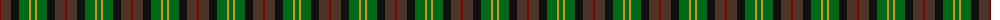
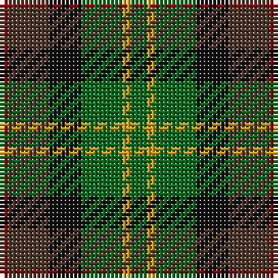

The parent of this is [Forres](/tartans/dr/2/t10/k8/g10/dy2/g/4/)

This was sourced from register-of-tartans.  It is a [6 stripes tartan](/stripes/stripes6/).

Original link https://www.tartanregister.gov.uk/tartanDetails.aspx?ref=1231

## Thread count
DR/2 T10 K8 G10 DY2 G/4

## Palette
Each colour and its ΔE from the base-6 reference it is a variant of.

| Colour | Shade | Base | ΔE (OKLab) |
|---|---|---|---|
| DR |  `#880000` | R  | 0.14 |
| DY |  `#D09800` | Y  | 0.11 |
| G |  `#006818` | G  | 0.02 |
| K |  `#101010` | K  | 0.17 |
| T |  `#4C3428` | B  | 0.16 |

# Sample pattern

ID: /variants/dr/2/t10/k8/g10/dy2/g/4-dr880000-dyd09800-g006818-k101010-t4c3428/
