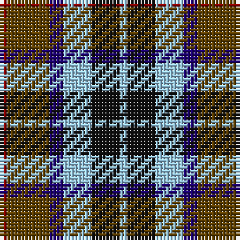

The parent of this is [Thompson's Fancy (Fashion)](/tartans/dr/2/t12/db4/lb8/k8/lb/2/)

This was sourced from tartans-authority.  It is a [6 stripes tartan](/stripes/stripes6/).

Original link http://www.tartansauthority.com/tartan-ferret/display/3595/

## Thread count
DR/2 T12 DB4 LB8 K8 LB/2

## Palette
Each colour and its ΔE from the base-6 reference it is a variant of.

| Colour | Shade | Base | ΔE (OKLab) |
|---|---|---|---|
| DB |  `#1C0070` | B  | 0.14 |
| DR |  `#880000` | R  | 0.14 |
| K |  `#101010` | K  | 0.17 |
| LB |  `#98C8E8` | W  | 0.17 |
| T |  `#604000` | G  | 0.14 |

# Sample pattern

ID: /variants/dr/2/t12/db4/lb8/k8/lb/2-db1c0070-dr880000-k101010-lb98c8e8-t604000/
