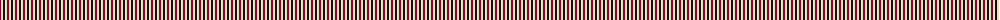
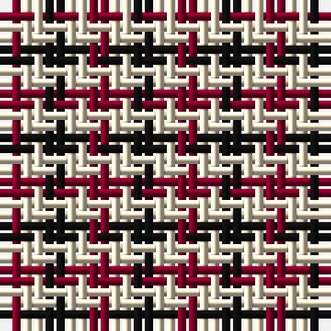

The parent of this is [Dacre (Estate Check)](/tartans/dr/2/w2/k/2/)

This was sourced from tartans-authority.  It is a [3 stripes tartan](/stripes/stripes3/).

Original link http://www.tartansauthority.com/tartan-ferret/display/7330/

## Thread count
DR/2 W2 K/2

## Palette
Each colour and its ΔE from the base-6 reference it is a variant of.

| Colour | Shade | Base | ΔE (OKLab) |
|---|---|---|---|
| DR |  `#800028` | R  | 0.16 |
| K |  `#101010` | K  | 0.17 |
| W |  `#F0E0C4` | W  | 0.06 |

# Sample pattern

ID: /variants/dr/2/w2/k/2-dr800028-k101010-wf0e0c4/
