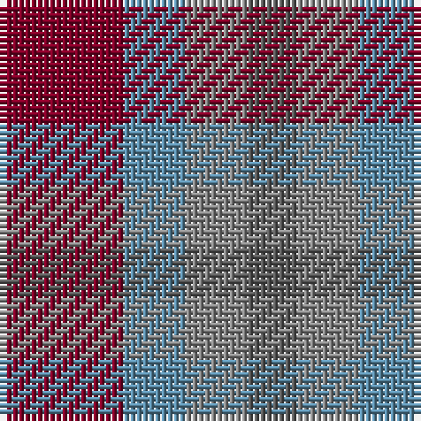

The parent of this is [Haggis Hostels](/tartans/dr/20/b10/na10/n/8/)

This was sourced from tartans-authority.  It is a [4 stripes tartan](/stripes/stripes4/).

Original link http://www.tartansauthority.com/tartan-ferret/display/11035/

## Thread count
DR/20 B10 Na10 N/8

## Palette
Each colour and its ΔE from the base-6 reference it is a variant of.

| Colour | Shade | Base | ΔE (OKLab) |
|---|---|---|---|
| B |  `#5C8CA8` | B  | 0.23 |
| DR |  `#800028` | R  | 0.16 |
| N |  `#5C5C5C` | B  | 0.14 |
| Na |  `#888888` | R  | 0.24 |

# Sample pattern

ID: /variants/dr/20/b10/na10/n/8-b5c8ca8-dr800028-n5c5c5c-na888888/
