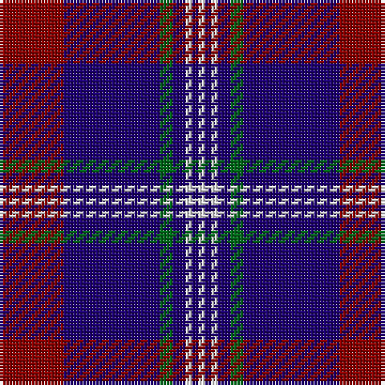

The parent of this is [Ikelman #4 (Personal)](/tartans/dr/20/db30/g4/db4/ln2/db2/ln/2/)

This was sourced from tartans-authority.  It is a [7 stripes tartan](/stripes/stripes7/).

Original link http://www.tartansauthority.com/tartan-ferret/display/2224/

## Thread count
DR/20 DB30 G4 DB4 LN2 DB2 LN/2

## Palette
Each colour and its ΔE from the base-6 reference it is a variant of.

| Colour | Shade | Base | ΔE (OKLab) |
|---|---|---|---|
| DB |  `#1C0070` | B  | 0.14 |
| DR |  `#880000` | R  | 0.14 |
| G |  `#006818` | G  | 0.02 |
| LN |  `#E0E0E0` | W  | 0.06 |

# Sample pattern

ID: /variants/dr/20/db30/g4/db4/ln2/db2/ln/2-db1c0070-dr880000-g006818-lne0e0e0/
