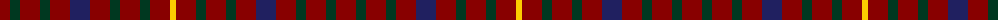

The parent of this is [Capricornica (Fashion)](/tartans/dr/20/dg10/dr20/dg10/dr20/db20/dr20/dg10/dr20/dg10/dr20/y/6/)

This was sourced from tartans-authority.  It is a [12 stripes tartan](/stripes/stripes12/).

Original link http://www.tartansauthority.com/tartan-ferret/display/3216/

## Thread count
DR/20 DG10 DR20 DG10 DR20 DB20 DR20 DG10 DR20 DG10 DR20 Y/6

## Palette
Each colour and its ΔE from the base-6 reference it is a variant of.

| Colour | Shade | Base | ΔE (OKLab) |
|---|---|---|---|
| DB |  `#202060` | B  | 0.11 |
| DG |  `#003820` | G  | 0.16 |
| DR |  `#880000` | R  | 0.14 |
| Y |  `#FCCC00` | Y  | 0.04 |

ID: /variants/dr/20/dg10/dr20/dg10/dr20/db20/dr20/dg10/dr20/dg10/dr20/y/6-db202060-dg003820-dr880000-yfccc00/
