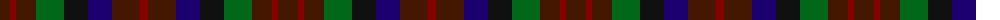

The parent of this is [Wcwm 1310](/tartans/dr/20/dra6/dr20/g28/k24/db24/dr28/dra/8/)

This was sourced from register-of-tartans.  It is a [8 stripes tartan](/stripes/stripes8/).

Original link https://www.tartanregister.gov.uk/tartanDetails.aspx?ref=4520

## Thread count
DR/20 DRa6 DR20 G28 K24 DB24 DR28 DRa/8

## Palette
Each colour and its ΔE from the base-6 reference it is a variant of.

| Colour | Shade | Base | ΔE (OKLab) |
|---|---|---|---|
| DB |  `#1C0070` | B  | 0.14 |
| DR |  `#441800` | B  | 0.22 |
| DRa |  `#880000` | R  | 0.14 |
| G |  `#006818` | G  | 0.02 |
| K |  `#101010` | K  | 0.17 |

# Sample pattern

ID: /variants/dr/20/dra6/dr20/g28/k24/db24/dr28/dra/8-db1c0070-dr441800-dra880000-g006818-k101010/
