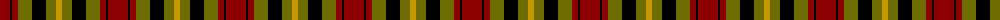
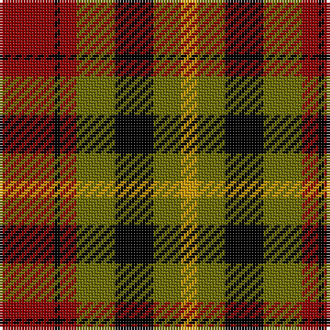

The parent of this is [Wcwm 1651](/tartans/dr/20/k2/dr6/g14/k14/g10/dy/6/)

This was sourced from register-of-tartans.  It is a [7 stripes tartan](/stripes/stripes7/).

Original link https://www.tartanregister.gov.uk/tartanDetails.aspx?ref=4537

## Thread count
DR/20 K2 DR6 G14 K14 G10 DY/6

## Palette
Each colour and its ΔE from the base-6 reference it is a variant of.

| Colour | Shade | Base | ΔE (OKLab) |
|---|---|---|---|
| DR |  `#8C0000` | R  | 0.13 |
| DY |  `#C89800` | Y  | 0.12 |
| G |  `#6C6C00` | G  | 0.11 |
| K |  `#000000` | K  | 0.00 |

# Sample pattern

ID: /variants/dr/20/k2/dr6/g14/k14/g10/dy/6-dr8c0000-dyc89800-g6c6c00-k000000/
