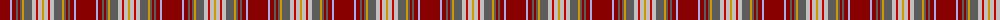

The parent of this is [Rathmore](/tartans/dr/20/lp2/dr4/n2/dr2/n2/dy2/n8/na4/r2/na4/dy/2/)

This was sourced from register-of-tartans.  It is a [12 stripes tartan](/stripes/stripes12/).

Original link https://www.tartanregister.gov.uk/tartanDetails.aspx?ref=3466

## Thread count
DR/20 LP2 DR4 N2 DR2 N2 DY2 N8 Na4 R2 Na4 DY/2

## Palette
Each colour and its ΔE from the base-6 reference it is a variant of.

| Colour | Shade | Base | ΔE (OKLab) |
|---|---|---|---|
| DR |  `#880000` | R  | 0.14 |
| DY |  `#D09800` | Y  | 0.11 |
| LP |  `#A8ACE8` | W  | 0.22 |
| N |  `#5C5C5C` | B  | 0.14 |
| Na |  `#C0C0C0` | W  | 0.16 |
| R |  `#C80000` | R  | 0.00 |

ID: /variants/dr/20/lp2/dr4/n2/dr2/n2/dy2/n8/na4/r2/na4/dy/2-dr880000-dyd09800-lpa8ace8-n5c5c5c-nac0c0c0-rc80000/
