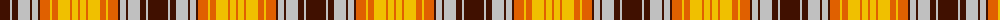

The parent of this is [MacGlashan](/tartans/dr/20/n2/dr6/n12/dr2/n6/dr2/o10/y2/o6/y12/o2/y6/o/2/)

This was sourced from weddslist.  It is a [14 stripes tartan](/stripes/stripes14/).

Original link http://www.weddslist.com/cgi-bin/tartans/pg.pl?source=sts

## Thread count
DR/20 N2 DR6 N12 DR2 N6 DR2 O10 Y2 O6 Y12 O2 Y6 O/2

## Palette
Each colour and its ΔE from the base-6 reference it is a variant of.

| Colour | Shade | Base | ΔE (OKLab) |
|---|---|---|---|
| DR |  `#401000` | B  | 0.23 |
| N |  `#C0C0C0` | W  | 0.16 |
| O |  `#E06000` | R  | 0.14 |
| Y |  `#F0C000` | Y  | 0.01 |

ID: /variants/dr/20/n2/dr6/n12/dr2/n6/dr2/o10/y2/o6/y12/o2/y6/o/2-dr401000-nc0c0c0-oe06000-yf0c000/
