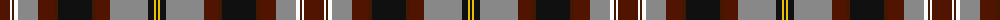

The parent of this is [Scottish Wildcat](/tartans/dr/20/w2/dra2/w4/n20/dr16/dra4/k34/dra4/dr14/n38/k6/y2/k/2/)

This was sourced from tartans-authority.  It is a [14 stripes tartan](/stripes/stripes14/).

Original link http://www.tartansauthority.com/tartan-ferret/display/11196/

## Thread count
DR/20 W2 DRa2 W4 N20 DR16 DRa4 K34 DRa4 DR14 N38 K6 Y2 K/2

## Palette
Each colour and its ΔE from the base-6 reference it is a variant of.

| Colour | Shade | Base | ΔE (OKLab) |
|---|---|---|---|
| DR |  `#501400` | B  | 0.22 |
| DRa |  `#441800` | B  | 0.22 |
| K |  `#101010` | K  | 0.17 |
| N |  `#888888` | R  | 0.24 |
| W |  `#FCFCFC` | W  | 0.03 |
| Y |  `#E8C000` | Y  | 0.00 |

ID: /variants/dr/20/w2/dra2/w4/n20/dr16/dra4/k34/dra4/dr14/n38/k6/y2/k/2-dr501400-dra441800-k101010-n888888-wfcfcfc-ye8c000/
