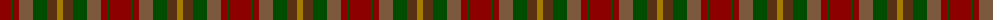
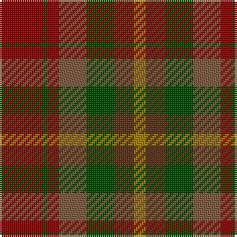

The parent of this is [Caledonian Maple (Fashion)](/tartans/dr/22/g2/dr6/lt14/g14/t10/dy/6/)

This was sourced from tartans-authority.  It is a [7 stripes tartan](/stripes/stripes7/).

Original link http://www.tartansauthority.com/tartan-ferret/display/3782/

## Thread count
DR/22 G2 DR6 LT14 G14 T10 DY/6

## Palette
Each colour and its ΔE from the base-6 reference it is a variant of.

| Colour | Shade | Base | ΔE (OKLab) |
|---|---|---|---|
| DR |  `#8C0000` | R  | 0.13 |
| DY |  `#A47C00` | R  | 0.20 |
| G |  `#004C00` | G  | 0.08 |
| LT |  `#7C583C` | G  | 0.16 |
| T |  `#583014` | G  | 0.18 |

# Sample pattern

ID: /variants/dr/22/g2/dr6/lt14/g14/t10/dy/6-dr8c0000-dya47c00-g004c00-lt7c583c-t583014/
