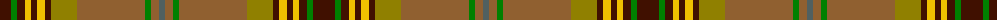

The parent of this is [Harmony 1](/tartans/dr/22/g6/dr8/y6/dr6/y8/dr6/lg26/lt68/g6/lt8/n/6/)

This was sourced from weddslist.  It is a [12 stripes tartan](/stripes/stripes12/).

Original link http://www.weddslist.com/cgi-bin/tartans/pg.pl?source=sts

## Thread count
DR/22 G6 DR8 Y6 DR6 Y8 DR6 LG26 LT68 G6 LT8 N/6

## Palette
Each colour and its ΔE from the base-6 reference it is a variant of.

| Colour | Shade | Base | ΔE (OKLab) |
|---|---|---|---|
| DR |  `#401000` | B  | 0.23 |
| G |  `#008000` | G  | 0.09 |
| LG |  `#908000` | G  | 0.19 |
| LT |  `#906030` | R  | 0.15 |
| N |  `#506060` | B  | 0.14 |
| Y |  `#F0C000` | Y  | 0.01 |

ID: /variants/dr/22/g6/dr8/y6/dr6/y8/dr6/lg26/lt68/g6/lt8/n/6-dr401000-g008000-lg908000-lt906030-n506060-yf0c000/
