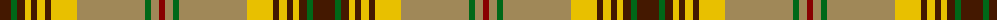

The parent of this is [Harmony 1 Trade Tartan Tartan Number: 1658. Earliest known date: pre 2003 LB may be Turquoise See products available Copyright © Blair Urquhart, Comrie, 2015](/tartans/dr/22/g6/dr8/ya6/dr6/ya8/dr6/y26/lt68/g6/lt8/dra/6/)

This was sourced from house-of-tartan.  It is a [12 stripes tartan](/stripes/stripes12/).

Original link http://www.house-of-tartan.scotland.net/house/TartanViewjs.asp?colr=Def&tnam=1658

## Thread count
DR/22 G6 DR8 Ya6 DR6 Ya8 DR6 Y26 LT68 G6 LT8 DRa/6

## Palette
Each colour and its ΔE from the base-6 reference it is a variant of.

| Colour | Shade | Base | ΔE (OKLab) |
|---|---|---|---|
| DR |  `#441800` | B  | 0.22 |
| DRa |  `#880000` | R  | 0.14 |
| G |  `#006818` | G  | 0.02 |
| LT |  `#A08858` | Y  | 0.21 |
| Y |  `#E8C000` | Y  | 0.00 |
| Ya |  `#E8C000` | Y  | 0.00 |

ID: /variants/dr/22/g6/dr8/ya6/dr6/ya8/dr6/y26/lt68/g6/lt8/dra/6-dr441800-dra880000-g006818-lta08858-ye8c000-yae8c000/
