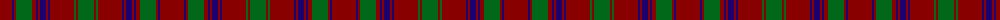

The parent of this is [MacDonald of Aird & Valley (Clan?)](/tartans/dr/24/db2/dr2/g16/dr4/db2/dr2/db6/dr2/db2/dr24/g2/dr2/g/16/)

This was sourced from tartans-authority.  It is a [14 stripes tartan](/stripes/stripes14/).

Original link http://www.tartansauthority.com/tartan-ferret/display/3274/

## Thread count
DR/24 DB2 DR2 G16 DR4 DB2 DR2 DB6 DR2 DB2 DR24 G2 DR2 G/16

## Palette
Each colour and its ΔE from the base-6 reference it is a variant of.

| Colour | Shade | Base | ΔE (OKLab) |
|---|---|---|---|
| DB |  `#1C0070` | B  | 0.14 |
| DR |  `#880000` | R  | 0.14 |
| G |  `#006818` | G  | 0.02 |

ID: /variants/dr/24/db2/dr2/g16/dr4/db2/dr2/db6/dr2/db2/dr24/g2/dr2/g/16-db1c0070-dr880000-g006818/
