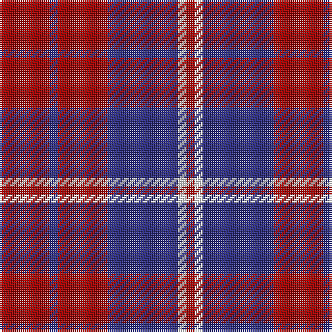

The parent of this is [British European](/tartans/dr/24/db4/dr24/db34/w4/dr/4/)

This was sourced from register-of-tartans.  It is a [6 stripes tartan](/stripes/stripes6/).

Original link https://www.tartanregister.gov.uk/tartanDetails.aspx?ref=363

## Thread count
DR/24 DB4 DR24 DB34 W4 DR/4

## Palette
Each colour and its ΔE from the base-6 reference it is a variant of.

| Colour | Shade | Base | ΔE (OKLab) |
|---|---|---|---|
| B |  `#1474B4` | B  | 0.15 |
| DB |  `#2C2C80` | B  | 0.05 |
| DR |  `#A00000` | R  | 0.09 |
| R |  `#C80000` | R  | 0.00 |
| W |  `#FCFCFC` | W  | 0.03 |

# Sample pattern

ID: /variants/dr/24/db4/dr24/db34/w4/dr/4-b1474b4-db2c2c80-dra00000-rc80000-wfcfcfc/
