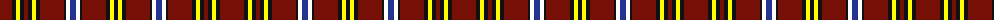

The parent of this is [City of New Bern 300](/tartans/dr/24/k4/y4/k4/dr4/k4/y4/k4/dr24/k2/w4/db6/w4/k2/dr24/k4/y4/k/4/)

This was sourced from register-of-tartans.  It is a [18 stripes tartan](/stripes/stripes18/).

Original link https://www.tartanregister.gov.uk/tartanDetails.aspx?ref=10034

## Thread count
DR/24 K4 Y4 K4 DR4 K4 Y4 K4 DR24 K2 W4 DB6 W4 K2 DR24 K4 Y4 K/4

## Palette
Each colour and its ΔE from the base-6 reference it is a variant of.

| Colour | Shade | Base | ΔE (OKLab) |
|---|---|---|---|
| DB |  `#26338F` | B  | 0.04 |
| DR |  `#760F06` | R  | 0.18 |
| K |  `#101010` | K  | 0.17 |
| W |  `#FFFFFF` | W  | 0.03 |
| Y |  `#FFFF00` | Y  | 0.16 |

ID: /variants/dr/24/k4/y4/k4/dr4/k4/y4/k4/dr24/k2/w4/db6/w4/k2/dr24/k4/y4/k/4-db26338f-dr760f06-k101010-wffffff-yffff00/
