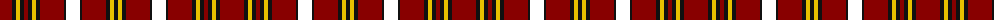

The parent of this is [City of New Bern 300 (District)](/tartans/dr/24/k4/y4/k4/dr4/k4/y4/k4/dr24/k2/w4/lrb6/w4/k2/dr24/k4/y4/k/4/)

This was sourced from tartans-authority.  It is a [18 stripes tartan](/stripes/stripes18/).

Original link http://www.tartansauthority.com/tartan-ferret/display/10034/

## Thread count
DR/24 K4 Y4 K4 DR4 K4 Y4 K4 DR24 K2 W4 LRB6 W4 K2 DR24 K4 Y4 K/4

## Palette
Each colour and its ΔE from the base-6 reference it is a variant of.

| Colour | Shade | Base | ΔE (OKLab) |
|---|---|---|---|
| DR |  `#880000` | R  | 0.14 |
| K |  `#101010` | K  | 0.17 |
| Y |  `#E8C000` | Y  | 0.00 |

ID: /variants/dr/24/k4/y4/k4/dr4/k4/y4/k4/dr24/k2/w4/lrb6/w4/k2/dr24/k4/y4/k/4-dr880000-k101010-ye8c000/
