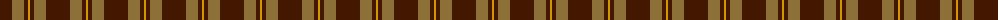
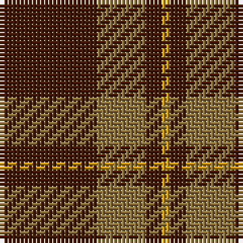

The parent of this is [Loch Garth (Fashion)](/tartans/dr/24/lt12/dr4/dy/2/)

This was sourced from tartans-authority.  It is a [4 stripes tartan](/stripes/stripes4/).

Original link http://www.tartansauthority.com/tartan-ferret/display/1750/

## Thread count
DR/24 LT12 DR4 DY/2

## Palette
Each colour and its ΔE from the base-6 reference it is a variant of.

| Colour | Shade | Base | ΔE (OKLab) |
|---|---|---|---|
| DR |  `#441800` | B  | 0.22 |
| DY |  `#D09800` | Y  | 0.11 |
| LT |  `#8C7038` | G  | 0.18 |

# Sample pattern

ID: /variants/dr/24/lt12/dr4/dy/2-dr441800-dyd09800-lt8c7038/
