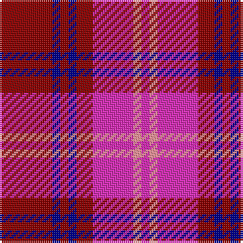

The parent of this is [Oakwood Purple (Fashion)](/tartans/dr/26/db4/dr4/db4/dr8/lra20/lr4/lra/4/)

This was sourced from tartans-authority.  It is a [8 stripes tartan](/stripes/stripes8/).

Original link http://www.tartansauthority.com/tartan-ferret/display/5531/

## Thread count
DR/26 DB4 DR4 DB4 DR8 LRa20 LR4 LRa/4

## Palette
Each colour and its ΔE from the base-6 reference it is a variant of.

| Colour | Shade | Base | ΔE (OKLab) |
|---|---|---|---|
| DB |  `#00008C` | B  | 0.13 |
| DR |  `#8C0000` | R  | 0.13 |
| LR |  `#FC949C` | Y  | 0.19 |
| LRa |  `#E02CB8` | R  | 0.22 |

# Sample pattern

ID: /variants/dr/26/db4/dr4/db4/dr8/lra20/lr4/lra/4-db00008c-dr8c0000-lrfc949c-lrae02cb8/
