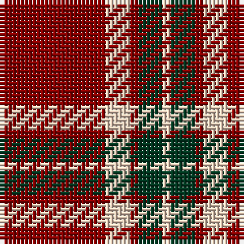

The parent of this is [Glen Shiel (Fashion)](/tartans/dr/26/lr6/dr2/dg6/lr/2/)

This was sourced from tartans-authority.  It is a [5 stripes tartan](/stripes/stripes5/).

Original link http://www.tartansauthority.com/tartan-ferret/display/8818/

## Thread count
DR/26 LR6 DR2 DG6 LR/2

## Palette
Each colour and its ΔE from the base-6 reference it is a variant of.

| Colour | Shade | Base | ΔE (OKLab) |
|---|---|---|---|
| DG |  `#003820` | G  | 0.16 |
| DR |  `#880000` | R  | 0.14 |
| LR |  `#E8CCB8` | W  | 0.11 |

# Sample pattern

ID: /variants/dr/26/lr6/dr2/dg6/lr/2-dg003820-dr880000-lre8ccb8/
