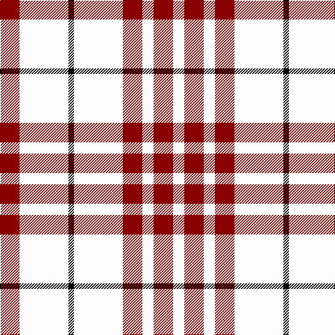

The parent of this is [Clayton Dress (Dance)](/tartans/dr/28/w70/k8/w70/dr28/w16/dr28/w/16/)

This was sourced from register-of-tartans.  It is a [8 stripes tartan](/stripes/stripes8/).

Original link https://www.tartanregister.gov.uk/tartanDetails.aspx?ref=670

## Thread count
DR/28 W70 K8 W70 DR28 W16 DR28 W/16

## Palette
Each colour and its ΔE from the base-6 reference it is a variant of.

| Colour | Shade | Base | ΔE (OKLab) |
|---|---|---|---|
| DR |  `#880000` | R  | 0.14 |
| K |  `#000000` | K  | 0.00 |
| N |  `#C8C8C8` | W  | 0.13 |
| W |  `#FCFCFC` | W  | 0.03 |

# Sample pattern

ID: /variants/dr/28/w70/k8/w70/dr28/w16/dr28/w/16-dr880000-k000000-nc8c8c8-wfcfcfc/
