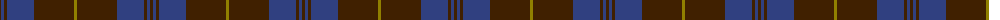

The parent of this is [Keeper of the Quaich](/tartans/dr/3/b3/dr3/b27/dr40/lg/3/)

This was sourced from weddslist.  It is a [6 stripes tartan](/stripes/stripes6/).

Original link http://www.weddslist.com/cgi-bin/tartans/pg.pl?source=sts

## Thread count
DR/3 B3 DR3 B27 DR40 LG/3

## Palette
Each colour and its ΔE from the base-6 reference it is a variant of.

| Colour | Shade | Base | ΔE (OKLab) |
|---|---|---|---|
| B |  `#304080` | B  | 0.01 |
| DR |  `#402000` | B  | 0.21 |
| LG |  `#908000` | G  | 0.19 |

# Sample pattern

ID: /variants/dr/3/b3/dr3/b27/dr40/lg/3-b304080-dr402000-lg908000/
